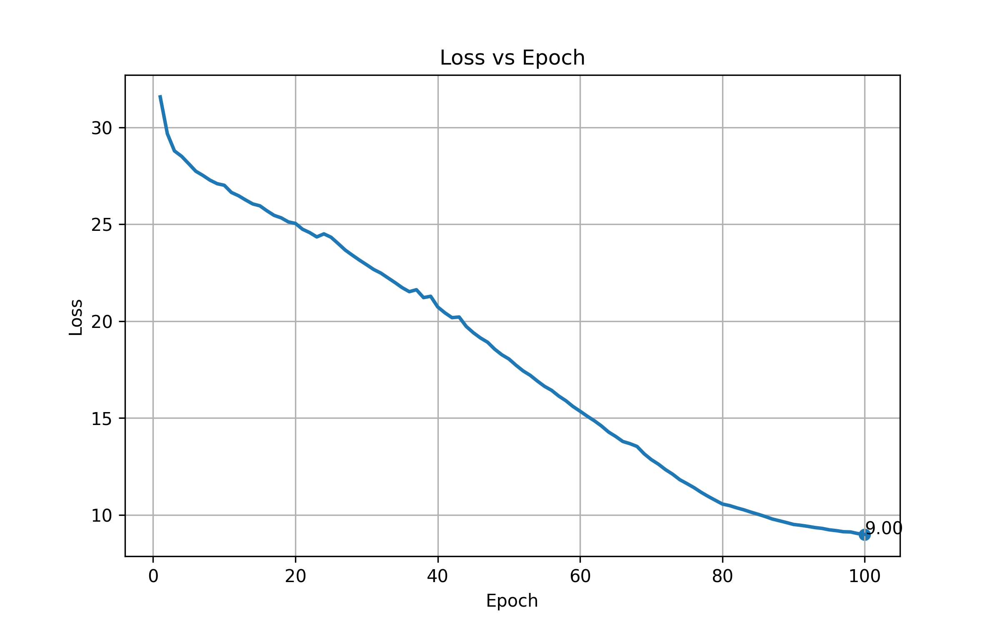
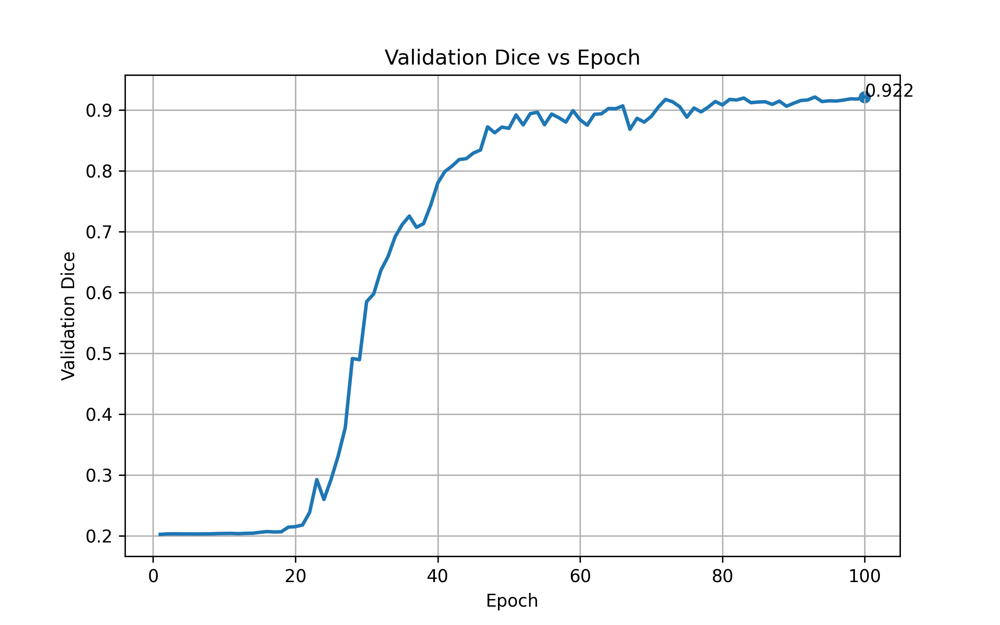

## Training & Validation Performance

### Loss Convergence

The training loss exhibits a **smooth and consistent decline** across epochs, indicating stable optimization and effective learning of volumetric features.

- Initial Loss: ~32  
- Final Loss: ~9.0  

This steady decrease demonstrates:
- Stable **gradient flow**
- Proper **learning rate selection**
- Effective **hybrid loss (Dice + BCE)**

---

### Validation Dice Score

The validation Dice score shows a **clear learning progression followed by convergence**, which is characteristic of a well-trained segmentation model.

- Early phase (Epoch 1–20): Minimal improvement (~0.20 → 0.22)  
- Learning phase (Epoch 20–40): Rapid increase (~0.22 → 0.80)  
- Convergence phase (Epoch 40–100): Stabilization around **0.92**  

Final performance:
- **Validation Dice Score ≈ 0.92**

---

###  Key Observations

- ✔️ Smooth and stable convergence  
- ✔️ No signs of overfitting (Dice does not degrade)  
- ✔️ Strong generalization across validation data  
- ✔️ Efficient learning within ~50 epochs  
- ✔️ Effective handling of **small and sparse CAC regions**

---

###  Interpretation

These results confirm that the implemented **3D U-Net pipeline**:

- Learns meaningful **spatial and contextual representations**
- Handles **class imbalance effectively**
- Produces **accurate and anatomically consistent segmentations**

The combination of **Dice loss and Binary Cross-Entropy loss** ensures:
- Overlap accuracy (Dice)
- Pixel-wise precision (BCE)

---

### Conclusion

The training dynamics demonstrate:

- **Stable optimization**
- **High segmentation accuracy (~0.92 Dice)**
- **Robust generalization**

This makes the pipeline suitable for **real-world medical imaging applications**, particularly for CAC detection and downstream clinical analysis.
